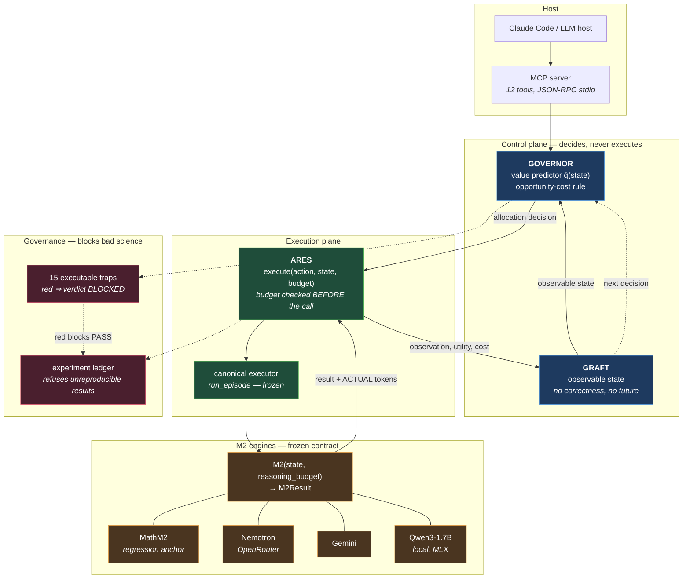
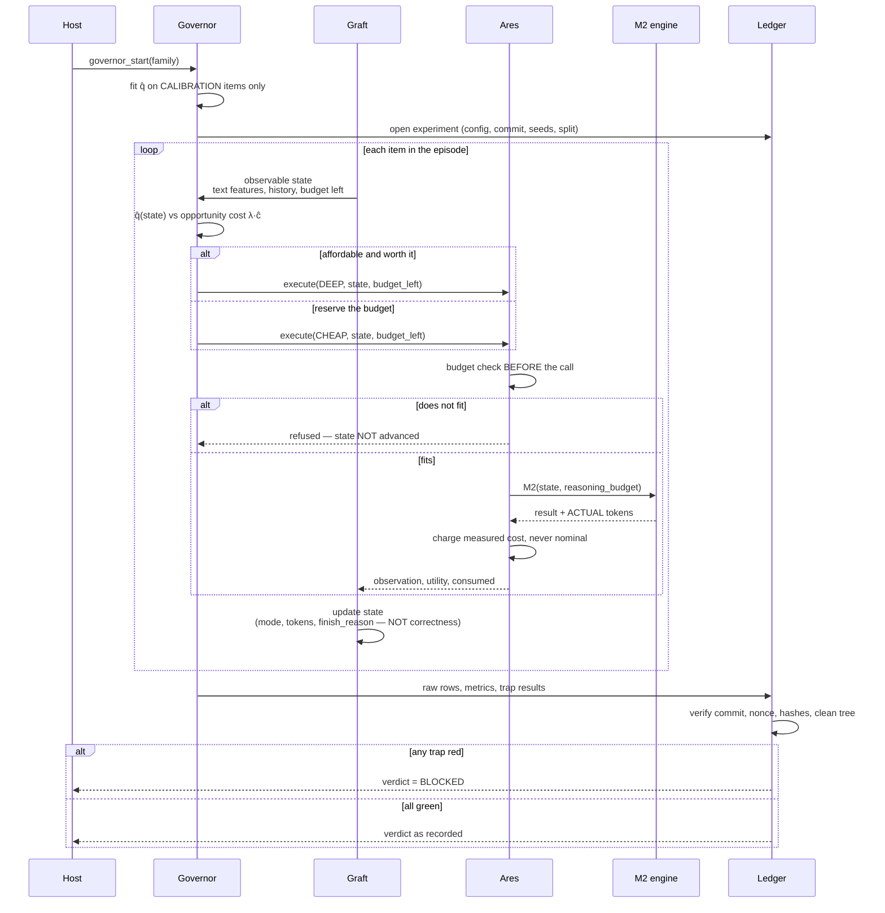
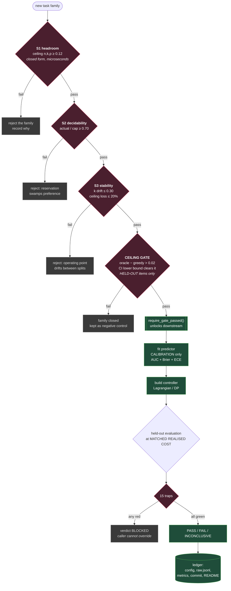
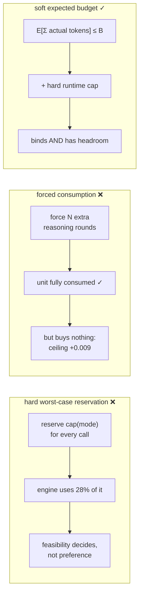

# Governor — Architecture

A reasoning-aware, budget-controlled compute-allocation layer for LLM agents.

The Governor decides **where scarce reasoning compute is worth spending**. It
does not reason, and it does not execute. Those are separate layers behind
frozen interfaces, which is what lets four different engines sit behind the same
contract without the controller knowing which one answered.

---

## 1. System architecture

**The one rule that holds the design together:** there is a *single* execution
path. `tests/test_ares.py` asserts that `AresLoop` reproduces the frozen
`run_episode` byte-for-byte on two environments and two task families, and
`tests/test_mcp.py` asserts the MCP harness reproduces it too. A plugin with its
own control loop would drift from the validated one while both kept working.

---

## 2. Decision loop — one episode

---

## 3. Experiment workflow — ceiling before controller

The order is frozen. Reversing it is how this project burned a day building a
controller for an environment with no headroom.

---

## 4. Resource contract

Three were tested on external data. Two were eliminated on measured grounds.

**Adopted:** `E[Σ actual tokens] ≤ B`, with a hard per-episode runtime cap and
costs charged from an exact tokenizer. `budget_adherence` (trap 14) enforces it:
a policy may under-spend, may not exceed its budget, and the baseline may never
be given fewer tokens than the policy used.

---

## 5. Frozen interfaces

| layer | contract | frozen by |
|---|---|---|
| Executor | `run_episode(env, policy, ep, budget) -> Trace` | `tests/test_reference_frozen.py` at 1e-12 |
| Ares | `execute(action, state, budget) -> ExecResult(observation, utility, consumed, state)` | trace-identical to the executor, two environments |
| M2 | `M2(state, reasoning_budget) -> M2Result(result, reasoning_tokens, total_tokens, latency_s, cost_units, ok, error)` | four backends, Governor unchanged |
| Environment | `reset / observe / step / utility / modes / cap / feasible` | `observe` carries no correctness and no future |
| Family | `features, feature_names, grade, system_prompt, heuristic_features` | swapping it is the *only* change needed for a new task family |
| Ledger | `ExperimentRun.finalize(...)` refuses rather than records | 13 provenance tests |

---

## 6. Status

| axis | state |
|---|---|
| **ENGINEERING** | GREEN — 257 tests, 26/26 experiments verify, smoke passes |
| **SCIENCE** | real-LLM Governor advantage **NOT VERIFIED** — 4 experiments, 3 axes, every CI crossing zero |

These are different axes. GREEN engineering does not mean the hypothesis held.
See `FINAL-CLAIMS.md` for the full VERIFIED / NOT VERIFIED / WITHDRAWN matrix.
