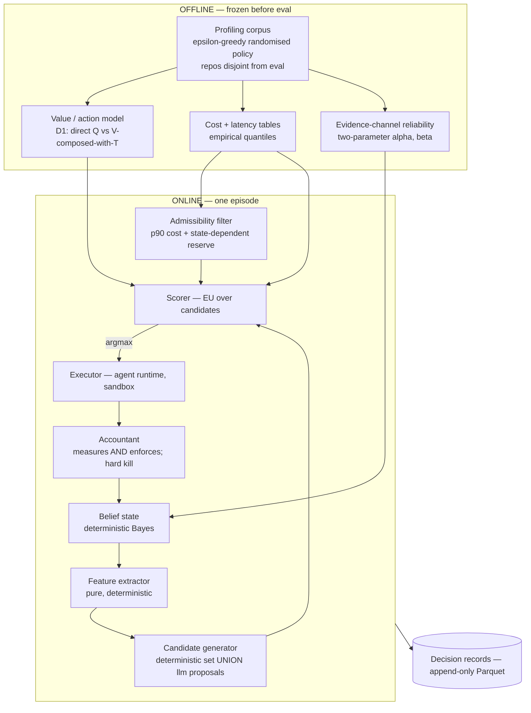

# Governor — Decision Record

**Working name:** *Governor* (a governor is a mechanical device external to an engine that meters fuel to it — which is exactly the architecture: an external, deterministic controller metering compute to an LLM agent). Rename freely.

**Status (rev 2):** **Direction frozen. Statistical specification NOT frozen.** Six decisions are deliberately deferred to the build stage where each becomes cheap to settle with data — see §0.2. Nothing below should be implemented as dogma; §3 is the build order, and every stage has a test and a drift check.
**Date:** 2026-08-14
**Supersedes:** `Idea/Decision & Architecture Research Prompt — Resource-Aware Cognitive Policy Layer.md` (the brief), and rev 1 of this document.

**Constraint added in rev 2:** the entire stack must be free and open-source, runnable end-to-end by a stranger with no paid API key, and shippable to GitHub with a README and reproducible metrics. This is now a first-class design constraint, not a nice-to-have — it changes §F and §J.2 materially (see §0.1 item 8).

---

## 0.1 Review response

An external review (ChatGPT) raised 19 points. Verdict on each, honestly:

| # | Point | Verdict | Where |
|---|---|---|---|
| 1 | Policy needs `Q(s,a)`, not `V(s)` | **Presentation fix, not a math error.** `EU(a) = E_{s'~T(s,a)}[V(s')]` *is* `Q(s,a)`; rev 1 also already flagged the causal problem in §H. But the review is right that it read like a footnote. Now explicit — **and demoted to an experiment**, because a simpler option (fit `Q` directly) exists that neither of us named | §G.2 |
| 2 | The Bayes likelihood equation is wrong | **Correct. Conceded.** Rev 1 silently assumed a symmetric channel (`β = 1−α`). That assumption is generally false. Corrected two-parameter form below | §G.3 |
| 3 | Keep Beta-Binomial on channels; condition it | **Agreed**, with a caveat: naive conditioning on `channel × task_class × outcome_type` shatters the data. Use partial pooling | §G.3 |
| 4 | LLM candidate generation is a proposal bottleneck | **Correct and important.** Accepted in full — dual-source candidate generation | §F.3 |
| 5 | p90 is not a hard guarantee | **Correct. Conceded**, and rev 1's "mean gives ~50% violation" was sloppy — the mean being exceeded 50% of the time is not the same as the budget being violated. Enforcement is now architecturally separate from estimation | §H.1 |
| 6 | Reserve should be state-dependent | **Correct.** Accepted | §H.1 |
| 7 | Modes-as-presets is right | Agreed, no change. Renaming is cosmetic; deferred | — |
| 8 | Effort tiers too vendor-specific | **Correct, and stronger than the review realised** — `effort: xhigh` is an Anthropic API parameter that *does not exist* on open-weight models. Under the new open-source constraint the abstraction is mandatory, not hygiene | §F.2 |
| 9 | `STOP` needs terminal variants | **Correct.** Accepted | §F.1 |
| 10 | Call it "sampled-branch regret" | **Correct.** Terminology fixed throughout | §J.4 |
| 11 | Oracle is only best-among-candidates | **Correct.** Accepted; follows from #4 | §J.4 |
| 12 | Heuristic baseline matters | Already first-class. No change | §J.3 |
| 13 | Missing ablations: no-cognitive-state, no-switching | **Correct, and the most valuable single addition.** Both added as required, not optional | §J.3 |
| 14 | Risk: cognitive layer is decorative | **The sharpest point in the review.** Accepted as a named kill gate — the layer earns its place or gets cut | §J.3, Stage 5 |
| 15 | Define the budget boundary precisely | **Correct.** Accepted | §H.4 |
| 16 | Don't call SWE-bench Verified "gold standard" | Fair. Softened | §J.1 |
| 17 | The 30-observations gate counts correlated data | **Correct.** Replaced with a clustering-adjusted effective-sample-size gate | §J.8 |
| 18 | Strengthen the provenance invariant | **Agreed.** Extended | §D |
| 19 | Don't call it frozen | **Correct.** Status changed | header |

**One correction I'd make to the review:** it treats the causal/observational problem as something the branch study fixes after the fact. There is a cheaper and much more important fix that neither of us named, and it is now the single most important addition in rev 2: **collect the profiling corpus under a deliberately randomised (ε-greedy) behaviour policy.** If the corpus is generated by one fixed policy, then in any given state you only ever observe the action that policy took — and *both* `Q(s,a)` and `V∘T` are unidentifiable, no matter which you pick. Randomised collection gives action overlap in every state region, which is what makes either estimator estimable at all. It costs nothing extra (you were running those episodes anyway) and it converts the branch study from *the only source of interventional data* into a *validation* of a model already fit on partially-interventional data. See §G.1.

## 0.2 The six deferred decisions

Per your instruction that the best approach is usually found by experiment rather than argument — these are *not* settled here. Each is scheduled at the stage where the data to settle it exists, with the comparison pre-specified so the choice is made by a number, not a preference.

| # | Question | Options | Decided at | Decided by |
|---|---|---|---|---|
| D1 | Direct `Q(s,a)` vs `V(s') ∘ T(s,a)` | Both | Stage 3 | Held-out-repo ECE + Brier, and action-ranking agreement with Stage 7 branch data |
| D2 | Value model family | L2 logistic vs gradient-boosted trees | Stage 3 | Out-of-repo calibration; ties broken toward the interpretable one |
| D3 | Uncertainty signal | Belief entropy vs inter-rollout action agreement ([2604.08369](https://arxiv.org/pdf/2604.08369)) vs both | Stage 5 | Feature ablation on value-model AUC + cost of obtaining the signal |
| D4 | Does cognitive state earn its place? | Keep vs cut | Stage 5 | Governor vs Governor-minus-cognitive-state. **If it ties, cut it and say so** |
| D5 | Evidence-channel likelihood | Fitted two-parameter (α, β) vs fixed conservative LR cap | Stage 5 | Whether enough resolved episodes exist to fit α, β with usable CIs |
| D6 | Effort tier count | 2 vs 3 tiers | Stage 4 | Tier-selection histogram; if a tier is never chosen, drop it |

---

## 1. Prior art and where the gap actually is

| Work | What it does | What it leaves open for you |
|---|---|---|
| **BAGEN** ([2606.00198](https://arxiv.org/html/2606.00198)) | Measures budget self-awareness via offline prefix replay. Universal optimism; success correlates only r≈0.35 with estimation quality; early-stop on "impossible" saves 28–64% tokens on failed trajectories for 1.6–4.2pp success cost | Explicitly separates estimation from execution. No controller. Names *online estimation during execution* and *multi-dimensional fungible budgets* as unsolved |
| **AVA** ([OpenReview](https://openreview.net/forum?id=JMDCMf7mlF)) | Budget-constrained controller: VOI-guided search, isotonic-calibrated uncertainty, verification cascades with early exit | Not an agentic environment — GSM8K/MATH/HotpotQA/HumanEval. No repo state, no tool-use loop, no deterministic regression tests |
| **The Replay Gap** ([2608.08239](https://arxiv.org/html/2608.08239)) | Proves static replay mis-scores per-step model switching; gives a branching-rollout protocol on SWE-bench Verified | Provides the *measurement harness*, no policy. Their switch is a fixed swap at 30%/70%, not a learned decision |
| **Rational Metareasoning for LLMs** ([2410.05563](https://arxiv.org/abs/2410.05563)) | VOC-shaped reward + expert iteration; 20–37% fewer tokens at equal accuracy | Trains the model. You build an external controller — complementary |
| **Don't Overthink It** ([2604.08369](https://arxiv.org/pdf/2604.08369)) | Inter-rollout action agreement as a free confidence signal | Now a candidate uncertainty signal in D3, and a baseline — don't reinvent it |
| **AI21 budget-aware Best-of-N** ([blog](https://www.ai21.com/blog/improving-best-of-n-with-budget-aware-execution-for-swe-agents/)) | ~50% of sampled SWE-bench tasks resolved by a *single* rollout while policies spent 5 on every task | Between-episode allocation. Yours is within-episode |

### The defensible contribution

> **An external, empirically-calibrated controller that allocates effort *within* a single agentic coding episode under hard multi-dimensional budgets — trained on randomised-policy rollouts, evaluated with branched counterfactuals rather than replay, against a hand-tuned heuristic and an LLM-as-controller baseline — on a fully open, reproducible stack.**

**Do not claim that adaptive budgeted allocation is novel.** AVA has it. Claim the intersection: agentic repo-level domain, external calibrated controller, randomised-corpus identification, branch-validated regret, open reproduction. Write that positioning into the README verbatim — it is stronger than a novelty claim a reviewer can puncture in one search.

---

## A. Problem statement

An LLM coding agent solving a repository-level issue under a hard resource envelope (tokens, USD/compute, wall-clock, tool calls) must repeatedly decide what to do next: gather context, attempt an edit, verify, or stop. Current agents make that decision implicitly inside the model's generation, or via a fixed scaffold that spends the same effort on a one-line fix and a multi-file refactor. The model's own sense of remaining budget is measurably and universally optimistic (BAGEN). **Governor externalises the decision into a deterministic controller that scores candidate next actions using measured costs and empirically calibrated success probabilities, subject to hard budget constraints enforced by a separate runtime accountant.**

## B. Hypothesis and falsifiers

**H1 (primary).** Under a reduced envelope (25–50% of what a fixed agent needs for its normal success rate), the calibrated controller achieves higher task success than (a) fixed strategy, (b) static routing, (c) the same LLM making the same allocation decisions in natural language — holding benchmark, models, tools, and context layer constant.

**H2.** At full budget, equal success at strictly lower cost per successful task.

**H3 (mechanism).** The value model is better calibrated (ECE, Brier — both vs. a base-rate predictor) than LLM verbalised self-assessment on the same states.

**H4 (added in rev 2).** Explicit cognitive state improves policy decisions over the same controller without it. *This is the hypothesis that keeps the project aligned with its original vision; if it fails, the honest move is to cut the layer.*

| Falsifier | What it kills |
|---|---|
| Heuristic (arm C) matches Governor within overlapping CIs at *every* budget level | H1. Report it; pivot to characterising *when* heuristics suffice |
| Value model ECE/Brier no better than base rate | H3. The policy is running on noise |
| Budget Violation Rate > 0 | An enforcement bug, not a result |
| Governor wins only at full budget | H1 — you measured "more compute helps", not "better allocation helps" |
| Branch data: chosen actions no closer to hindsight-best than baseline's | The policy chooses differently, not better |
| Governor ≈ Governor-minus-cognitive-state | H4. Cut the layer; the project becomes a budget controller and says so |

H1 predicts the effect lives **under scarcity**. A full-budget-only experiment is the standard way this project shape produces an uninterpretable null.

## C. Architecture



**One sentence:** the LLM says *what could be done*; the controller says *what it costs, how likely it is to help, and whether we can afford it*; the accountant says *what it actually cost, and stops the run when the money is gone.*

## D. Component responsibilities

| Layer | Owns | Explicitly does NOT own | LLM role | Deterministic role |
|---|---|---|---|---|
| **1. Task profiler** | Observable task features | Predicting difficulty as a free number | Task-type enum only | All counts from text/repo |
| **2. Context layer** | Feature supply + one metered retrieval action | Being the contribution; the episode's critical path | None | Pre-built offline, cached, **identical in every arm** |
| **3. Cognitive state** | Belief vector, evidence log, entropy | Probability values from the model | Proposes hypotheses; predicts observation *sign* | Likelihoods from fitted channel reliability; π updated in code |
| **4. Accountant** | **Measurement *and* enforcement**; hard kill switches | Estimating anything | None | Token counts from serving layer; `time.monotonic()`; process/container kill |
| **5. Performance model** | Calibrated prediction + uncertainty | Explaining itself in prose | None | scikit-learn; isotonic calibration; empirical quantiles with shrinkage |
| **6. Policy** | Argmax, constraint filter, overrides | Executing anything | None | Pure arithmetic |
| **7. Executor** | Running the chosen action in the sandbox | Deciding | Full agentic generation *within* the chosen mode and tier | Timeouts, token caps, container isolation |

**Load-bearing invariant (strengthened per review #18).** Every number the policy consumes carries full provenance and the policy refuses any estimate lacking it:

```python
@dataclass(frozen=True)
class Estimate:
    value: float
    ci: tuple[float, float] | None
    source: Literal["measured", "fitted", "derived"]
    model_id: str | None          # e.g. "value_lr_v3"
    data_version: str | None      # corpus hash the model was fit on
    fitted_at: datetime | None
    n_effective: int | None       # clustering-adjusted, see J.8
```

This makes the brief's central principle a type error rather than a code-review convention, and makes every decision record answer "where did this number come from?" without archaeology.

## E. State schema

```python
TaskState = {
  "instance_id": str, "repo": str, "base_commit": str, "issue_text": str,
  "features": {"issue_tokens": int, "has_stack_trace": bool, "n_code_blocks": int,
               "n_candidate_files": int, "max_dependency_depth": int,
               "has_reproducing_test": bool},
  "task_class": Literal["bug_fix","feature","refactor","test_fix"],   # LLM: categorical only
}

CognitiveState = {
  "goal": str,
  "hypotheses": [{"id":"H1","description":str,"status":"active|refuted|confirmed"}],  # k<=5 + "other"
  "belief": [float],                      # written ONLY by update_belief()
  "evidence": [{"id":"E7","action_id":"A12","channel":"pytest_targeted",
                "predictions": {"H1": 1, "H2": 0},   # LLM: binary sign only
                "observation": 0,
                "likelihoods": [float]}],            # computed, never generated
  "entropy": float, "steps_since_new_evidence": int,
}

ResourceState = {
  "envelope": {"max_tokens":int,"max_cost":float,"max_wall_s":float,"max_tool_calls":int},
  "consumed": {...}, "reserve": {...},    # state-dependent, see H.1
  "token_detail": {"input":int,"output":int,"cache_read":int,"cache_creation":int},
  "boundary": Literal["episode"],         # see H.4
}

DecisionRecord = {
  "decision_id":int, "episode_id":str, "t":float, "features": {...},
  "candidates": [{"action_class":str,"mode":str,"tier":str,
                  "provenance": Literal["deterministic","llm"],   # review #4/#11
                  "q": Estimate, "cost": {"p50":Estimate,"p90":Estimate},
                  "latency": {"p50":Estimate,"p90":Estimate},
                  "admissible":bool, "eu":float}],
  "chosen":str, "reason_code":str,        # enum, not prose
  "exploration": {"epsilon":float,"was_random":bool},   # corpus collection, see G.1
  "outcome": {"actual_cost":float,"actual_latency":float,
              "observation_class":str,"belief_delta":float,"truncated":bool},
  "config_hash": str,                     # arm-parity assertion, see 3.x drift checks
}
```

`reason_code` ∈ `{HIGHEST_EU, ONLY_ADMISSIBLE, BUDGET_FLOOR, STOP_VERIFIED, STOP_NEGATIVE_EU, FALLBACK_LOW_CONFIDENCE, EXPLORATION_RANDOM}`. An enum, not free text — that is what makes the brief's §28 real: the explanation is reconstructible from state + formula, so there is no post-hoc narrative to hallucinate.

## F. Action model

### F.1 Modes — with explicit terminal variants (review #9)

| Mode | Meaning | Terminal |
|---|---|---|
| `EXPLORE` | Reduce uncertainty: read, retrieve, run a diagnostic | No |
| `EXPLOIT` | Act on the leading hypothesis: edit | No |
| `VERIFY` | Run acceptance / regression tests | No |
| `STOP_VERIFIED` | Submit a patch whose tests have passed | Yes |
| `STOP_UNVERIFIED` | Submit a patch that was never verified | Yes |
| `STOP_FAILURE` | Report failure with bounded uncertainty | Yes |

The three terminals have genuinely different utilities: `EU(STOP_VERIFIED)` ≈ the observed test outcome; `EU(STOP_UNVERIFIED)` = `P(patch passes | never ran tests)`, a strictly different and lower-confidence quantity. Collapsing them lets the value model report "0.82, good enough" without distinguishing whether anything was actually checked.

### F.2 Effort tiers — abstract, with a per-model capability profile (review #8)

`effort: "xhigh"` is an Anthropic API parameter. **It does not exist on open-weight models**, so under the open-source constraint the abstraction is required for the thing to run at all:

```yaml
# configs/models/qwen3-local.yaml
tiers:
  T0: {model: "Qwen3-4B-Instruct",  max_think_tokens: 0,    max_steps: 3,  n_samples: 1}
  T1: {model: "Qwen3-4B-Instruct",  max_think_tokens: 2048, max_steps: 8,  n_samples: 1}
  T2: {model: "Qwen3-14B-AWQ",      max_think_tokens: 8192, max_steps: 15, n_samples: 3}

# configs/models/hosted.yaml   (transfer run only)
tiers:
  T0: {model: "claude-haiku-4-5", effort: "low",   thinking: disabled}
  T1: {model: "claude-sonnet-5",  effort: "high"}
  T2: {model: "claude-opus-5",    effort: "xhigh"}
```

The policy only ever sees `T0 | T1 | T2`. Swapping providers is a config file. This is also the thing that makes the repo usable by strangers with different hardware.

**D6:** if the Stage-4 tier histogram shows a tier is never selected, drop it. Three tiers is a hypothesis, not a commitment.

### F.3 Dual-source candidate generation (review #4 — accepted in full)

Rev 1 had the LLM propose all candidates, which means the controller can only ever pick from the LLM's brainstorm. If the right action is "run test X" and the LLM proposes three file inspections, a mathematically perfect policy still can't choose it — and you end up measuring proposal quality, not policy quality.

```
candidates = deterministic_candidates(state) ∪ llm_candidates(state)
```

**Deterministic generator** (always available, guarantees action-space completeness):
- `VERIFY` at each admissible tier — always
- All three `STOP_*` variants — always
- `EXPLORE`: retrieval of the top-k context-graph neighbours of touched symbols; re-run of the last failing test; read of the file with the highest impact-radius score
- `EXPLOIT`: re-apply / revert the last edit

**LLM generator** (semantics the graph can't supply): inspect *this* function, investigate *this* suspected dependency, edit *this* file to test *this* hypothesis. Structured output, strict schema, classified into `(mode, action_class)`.

Each candidate is tagged `provenance`, so you get a free and genuinely interesting metric: **what fraction of chosen actions came from the deterministic set vs the LLM?** If it's ~100% deterministic, the LLM proposer is dead weight and you can delete it. If it's ~100% LLM, the completeness guarantee is doing nothing and the oracle-scope caveat in §J.4 becomes severe.

## G. Probability model

### G.1 The corpus must be collected under a randomised policy — the key addition in rev 2

Fit any action-conditional model on a corpus generated by a single fixed policy and you have no action overlap: in state region R the behaviour policy always chose action `a₁`, so `Q(R, a₂)` is unidentifiable and no amount of regularisation fixes it. This is not a subtlety — it is the difference between a model that means something and one that fits noise.

**Collect the profiling corpus with an ε-greedy behaviour policy** (ε ≈ 0.3, decaying to ~0.15): at each decision, with probability ε pick uniformly at random from the admissible candidate set, otherwise follow the current heuristic. Log `exploration.was_random`. It costs nothing — you were running those episodes anyway.

This buys three things:
1. **Identifiability.** Every action class is observed across the state space.
2. **Partial interventionality.** Randomised choices are unconfounded by construction, so a model fit on them has a causal reading; you can also weight by inverse propensity if you want to be strict.
3. **It downgrades the branch study from load-bearing to confirmatory.** Branching now *validates* a model that was already estimable, rather than being the sole source of causal signal. That is a much less fragile plan.

### G.2 Direct `Q` vs `V ∘ T` — deferred to experiment (D1)

Both are on the table; the review's framing assumed the second. Written explicitly:

```
Option A — direct:      Q(s,a) = P(episode succeeds | s, a)
                        one model, action one-hots + a few interaction terms

Option B — composed:    V(s,b) = P(succeeds | s, b)
                        T(s,a) = distribution over feature deltas for a
                        Q(s,a) = E_{s'~T(s,a)}[ V(s', b − c(a)) ]

Policy (either way):    a* = argmax_{a ∈ admissible} [ Q(s,a) · U_success
                                                       − λ_c·cost(a) − λ_t·latency(a) ]
```

A is simpler and has one fewer thing to be wrong. B shares statistical strength across actions, which matters when data is thin. **Neither escapes the causal problem — §G.1 is what addresses that, not the choice between A and B.** Fit both at Stage 3 on the same corpus; pick on held-out-repo calibration, then re-check the winner's action *ranking* against Stage-7 branch data. If they agree, ship A for simplicity.

### G.3 Evidence-channel likelihood — corrected (review #2, conceded)

Rev 1 wrote `P(obs | H) = hit_rate` when the observation matched the prediction and `1 − hit_rate` otherwise. **That is only correct for a symmetric channel** — it silently assumed the false-alarm rate equals one minus the hit rate, which is generally false. A channel can be very likely to fire when it should *and* moderately likely to fire when it shouldn't; one parameter cannot express that.

**Corrected form.** For channel `c`, binary observation `o ∈ {0,1}`, and the LLM's binary prediction `pred_i` for hypothesis `H_i`:

```
α_c = P(o = 1 | H_i true, pred_i = 1)     "fires when it should"      (sensitivity)
β_c = P(o = 1 | H_i true, pred_i = 0)     "fires when it shouldn't"   (1 − specificity)

                 ⎧ α_c        if pred_i = 1, o = 1
P(o | H_i) =     ⎪ 1 − α_c    if pred_i = 1, o = 0
                 ⎨ β_c        if pred_i = 0, o = 1
                 ⎩ 1 − β_c    if pred_i = 0, o = 0

π_i  ←  π_i · P(o | H_i)  /  Σ_j π_j · P(o | H_j)
```

Between two hypotheses making opposite predictions this yields `LR⁺ = α/β` and `LR⁻ = (1−α)/(1−β)` — the standard diagnostic-test likelihood ratios. Rev 1's formula is the special case `β = 1 − α`.

**Two independent Beta posteriors per channel**, estimated from logged `(prediction, observation, resolved-hypothesis)` triples:

```
α_c ~ Beta(a₁ + s₁, b₁ + f₁)      from cases where pred = 1 and H was ultimately true
β_c ~ Beta(a₀ + s₀, b₀ + f₀)      from cases where pred = 0 and H was ultimately true
```

**The real constraint (flag this now):** you can only label these from *resolved* episodes, where you know which hypothesis was actually correct. If the profiling corpus has few resolved episodes, α and β will have CIs too wide to be useful.

**D5 — the fallback, and the honest v0.** Start with a **fixed conservative likelihood ratio cap** (`LR ∈ [1/3, 3]`, i.e. `α = 0.75, β = 0.25`): evidence moves belief in the right direction but can never make it overconfident. Zero fitted parameters, fully deterministic, defensible. Upgrade to fitted `(α, β)` only when Stage 5 shows enough resolved episodes per channel. Ship the fallback; treat the fitted version as an improvement to be earned.

**Conditioning (review #3):** channel reliability plausibly varies by task class, but `channel × task_class × observation_type` shatters a small corpus. Use **partial pooling** — a global channel prior with per-task-class shrinkage proportional to that cell's count. One line in the estimator, avoids both extremes.

### G.4 Calibration reporting

Report ECE, Brier, and log loss **alongside a base-rate predictor on the same split**, plus reliability diagrams and calibration drift across budget levels. A model that always outputs the base rate scores respectably on Brier; if yours doesn't beat it, you have no signal and every downstream number is decoration. **This is the Stage-3 gate.**

**Uncertainty and cold start.** Laplace approximation → credible interval per prediction; shrink thin cells toward a pooled per-mode prior. If the CI width on the argmax exceeds τ, defer to arm C's heuristic and record `FALLBACK_LOW_CONFIDENCE`.

## H. Utility, constraints, and enforcement

### H.1 Estimation and enforcement are separate systems (review #5, #6 — conceded)

Rev 1 implied p90 admissibility delivers BVR ≈ 0. It does not. p90 means ~10% of that action's realised costs exceed the estimate; it is a probabilistic planning threshold, not a guarantee. Rev 1's "the mean gives ~50% violation" was also wrong — exceeding an *estimate* half the time is not the same as violating a *budget*, since violation additionally requires the overrun to exhaust remaining slack and reserve.

**Correct architecture — two layers, different jobs:**

| Layer | Mechanism | Guarantees | Metric |
|---|---|---|---|
| **Statistical admissibility** | `consumed[d] + cost_p90[a,d] + reserve[d](s) ≤ envelope[d]`, ∀d | Nothing hard. Reduces the *rate* of overruns | **Truncation rate** |
| **Runtime enforcement** | Hard caps in the accountant: per-call `max_tokens`, wall-clock timeouts, container kill, refuse-to-dispatch when `remaining ≤ 0` | **BVR = 0 by construction** | **BVR** |

This is a better decomposition than rev 1 had, and it makes both numbers meaningful: BVR = 0 is an *engineering* claim proved by the enforcement layer (and asserted in CI), while the p90 rule's job is to minimise **truncation events** — actions killed mid-flight, which usually cost you the episode. Report both. A policy that never truncates but leaves 40% of budget unused is over-conservative, and you can now see that.

**Reserve is state-dependent (review #6):**

```
reserve(s) = conservative_cost_to_terminate_safely(s)
           = p90[VERIFY@T0] + p90[STOP_*]     if unverified
           = p90[STOP_VERIFIED]                if already verified
```

### H.2 Objective

```
EU(a) = Q(s,a) · U_success − λ_c · cost(a) − λ_t · latency(a)
a*    = argmax_{a ∈ admissible} EU(a)
```

**Information gain stays implicit**, not a separate `λ_info` term. An `EXPLORE` action that resolves ambiguity lowers `belief_entropy`, a feature of the model; if reduced entropy genuinely predicts success, exploration is priced correctly with no hand-set λ and no hallucinable number. Explicit IG remains an ablation (Stage 8), conditional on the implicit route underperforming.

### H.3 Presets, not modes

`MAX / BALANCED / ECONOMY / SMART` are presets of `(λ_c, minimum-success-floor)` over one objective. One implementation, four YAML files. (Renaming to `performance / balanced / efficiency / adaptive` is cosmetic — do it at packaging time.)

### H.4 Budget boundary — defined precisely (review #15)

| Bucket | Contents | Counted against envelope? | Reported? |
|---|---|---|---|
| **Episode budget** | Everything after `task_start`: model calls, tool calls, test runs, retrieval queries against the pre-built graph | **Yes** | Yes, per episode |
| **Infrastructure** | Context-graph construction, Docker image build, model loading | **No** | **Yes, separately and prominently** — amortised per repo, with the amortisation window stated |

Reporting infrastructure cost separately but *visibly* is what stops a reviewer asking "you claim $0.20/task but spent $0.40 building the graph." Both numbers go in the README results table.

## I. Switching policy

| Trigger | Condition | Action |
|---|---|---|
| **Verified stop** | Acceptance ∧ regression tests pass | `STOP_VERIFIED` immediately |
| **Budget floor** | Any dimension < reserve(s) + p90(cheapest admissible) | Force `VERIFY@T0` → terminal. Never strand the episode unable to verify |
| **Contradiction** | Evidence flips the argmax hypothesis, or `H(π)` rises > δ | Clear the effort ratchet; higher tiers become eligible again |
| **Stagnation** | `steps_since_new_evidence` > σ | Ban repeating the last action class; `Q` drives a terminal via negative EU |

**Escalation is ratcheted, de-escalation is free.** A tier may rise at most one step per decision; it may drop to `T0` at any time. Prevents a single noisy estimate from burning the envelope in one jump.

## J. Evaluation protocol

### J.1 Data

| Role | Dataset | n | Note |
|---|---|---|---|
| Profiling (ε-greedy) | SWE-smith ([~50k instances, 128 repos](https://github.com/SWE-bench/SWE-smith)) + SWE-Gym ([2,438](https://github.com/SWE-Gym/SWE-Gym)) | 300–600 episodes | Procedurally generated → low contamination risk |
| Held-out eval | SWE-bench Verified ([500 human-validated](https://openai.com/index/introducing-swe-bench-verified/)) | stratified 120–150 | Widely used, human-validated, deterministic `FAIL_TO_PASS`/`PASS_TO_PASS`. Not contamination-free — say so |

**Repo-level disjoint split**, not instance-level. Instance-level leaks file structure, test conventions, and dependency shape into your features.

### J.2 Compute — free tier first

| Path | Hardware | Models | Cost |
|---|---|---|---|
| **Primary** | 1× 24GB GPU (rented ~$0.20–0.40/hr) | Qwen3-4B-Instruct (FP8), Qwen3-14B (AWQ) via vLLM | Compute-hours |
| **Free** | Kaggle (~30 GPU-hr/week, T4×2) or Colab T4 | Qwen3-4B-Instruct only; T0/T1 tiers, T2 = 4B with more samples | $0 |
| **Transfer confirmation** | Hosted API | Haiku 4.5 / Sonnet 5 / Opus 5 | n≈40 instances only |

The Replay Gap ran ~900 rollouts and 717 scored branch pairs with exactly this class of model on **a single 24GB GPU**. That is the existence proof that the design fits the budget. The free-tier path is slower and caps `T2`, which weakens the tier study — note that limitation in the README rather than hiding it.

### J.3 Arms — all sharing identical context layer, tools, models, envelope

| Arm | Description | Isolates |
|---|---|---|
| **A** | Fixed strategy, one tier throughout | Floor |
| **B** | Static routing: tier chosen once from task features | Routing vs *switching* |
| **C** | Hand-tuned heuristic | **The honest strong baseline.** A tie is a finding |
| **D** | LLM-as-controller: same state as text, model picks in natural language | **The entire thesis.** If D ties E, the calibrated layer adds nothing |
| **E** | Governor (full) | — |
| **E⁻ᶜᵒᵍ** | Governor minus cognitive state — features only, no belief/entropy | **H4 / D4.** Is the cognitive layer decorative? (review #13/#14) |
| **E⁻ˢʷ** | Governor minus switching — scores once at t=0, never re-decides | How much comes from *switching* vs *initial allocation* |
| **F** | Hindsight oracle over the admissible candidate set (from branch data) | Regret denominator |

**Arms D, E⁻ᶜᵒᵍ, and E⁻ˢʷ are the three most likely to be cut under time pressure and the three that carry the interpretation.** Without D you can't claim the calibration matters; without E⁻ᶜᵒᵍ you can't claim the cognitive layer matters; without E⁻ˢʷ you can't claim *switching* matters as opposed to good initial routing. Protect all three.

### J.4 Sampled-branch counterfactual protocol (review #10, #11)

Adopted from The Replay Gap. Per instance:
1. Run a base trajectory to completion.
2. Fork at **30% and 70%** of trajectory length.
3. Per fork: fresh container, re-execute pre-fork actions in recorded order, inject the recorded message history.
4. Execute each of ≤4 admissible candidates to completion.
5. Same-action control forks to isolate serving nondeterminism.

**Terminology, precisely:** this yields **sampled-branch regret over the admissible candidate set at sampled decision points** —

```
Regret(d) = U(a*_hindsight-among-candidates, d) − U(a_chosen, d)
```

Two caveats to state in the paper rather than let a reviewer find:
- Regret is measured at **2 sampled fork points**, not at every decision.
- The oracle is **best-among-candidates**, not best-among-all-feasible-actions. §F.3's deterministic generator narrows this gap; the `provenance` field lets you quantify what it covers.

Budget: 2 forks × ~4 candidates × ~40 instances ≈ 320 branch rollouts + controls.

**Do not build a log-stitching offline evaluator.** Theirs went 0-for-5 on outcome predictions with predicted-vs-actual patch similarity of 0.00–0.11.

### J.5 Metrics

| Class | Metric | Note |
|---|---|---|
| Effectiveness | Task Success Rate | Deterministic tests only. **Never an LLM judge** where tests exist |
| Efficiency | Cost / tokens / tool-calls per *successful* task | Median and full distribution |
| Compliance | **BVR** (enforcement) and **truncation rate** (statistics) | Separate numbers, separate mechanisms (§H.1) |
| Utilisation | consumed / allocated | Explicitly **not** to be maximised |
| Policy quality | Sampled-branch regret; switch precision/recall; premature-stop rate; post-plateau spend | Requires branch data |
| Model quality | ECE, Brier, log loss — **each vs. base rate** | Stage-3 gate |
| Attribution | Candidate provenance (deterministic vs LLM); tier histogram | Free, and tells you what to delete |
| Robustness | `GracefulDegradation(B) = Perf(B)/Perf(100%)` at 100/75/50/25/10% | Headline figure |
| Infrastructure | Graph build cost, amortised per repo | Reported separately (§H.4) |

### J.6 Statistics

- **Paired design.** Every arm sees every task with the same seeds. **McNemar** for paired binary, **paired bootstrap** for cost ratios. Unpaired analysis at n=150 has almost no power for a 5pp effect.
- **Pre-registered primary endpoint:** success rate at 50% budget. Secondary: cost per success at 100%. Everything else is exploratory and labelled so. `PREREGISTRATION.md` committed and timestamped *before* the first eval run.
- 3 seeds per (task, arm). Agents are nondeterministic even at temperature 0.
- CIs everywhere; p-values secondary.

### J.7 Robustness injections

Tool failures, a misleading test result, mid-episode budget cut (halve remaining), latency spikes. Measure recovery rate, BVR, truncation. The mid-episode budget cut is the cheapest persuasive demo — a static policy cannot respond to it at all.

### J.8 Corpus sufficiency gate — clustering-adjusted (review #17)

"≥30 observations per action class" was a weak gate: checkpoints within an episode are highly correlated, so raw counts overstate information. Replace with:

```
ESS = n_checkpoints / (1 + (m̄ − 1)·ρ)     # m̄ = mean checkpoints/episode
                                           # ρ = intra-episode correlation of the residual
```

**Gate (all must hold before fitting):**
- ESS ≥ 200 for the value model overall
- ≥ 25 **distinct episodes** contributing to each `(mode, tier)` cell
- ≥ 40 successful and ≥ 40 failed episodes (you need both classes; a corpus that is 95% failures cannot calibrate the upper range)
- ≥ 20 episodes per **repo family**, and ≥ 8 distinct repo families

If the gate fails, the fix is more *diverse* episodes, not more checkpoints from the same ones.

## K. Open-source stack and repository

### K.1 Everything free, everything reproducible

| Component | Choice | Licence¹ |
|---|---|---|
| Serving | **vLLM** (or Ollama for the laptop path) | Apache-2.0 |
| Models | **Qwen3-4B-Instruct**, **Qwen3-14B-AWQ** | Apache-2.0 |
| Agent scaffold | **mini-swe-agent** class (~100 lines) — a loop you can interrupt at every step | MIT |
| Grading | **SWE-bench official Docker harness** — never reimplement pass/fail | MIT |
| Branching | Adapt **The Replay Gap** harness + released trajectories | cite |
| Datasets | HF: `SWE-bench_Verified`, `SWE-Gym`, `SWE-smith` | per-dataset |
| Stats | scikit-learn, numpy, scipy | BSD |
| Storage | Parquet + DuckDB (no service to run) | MIT |
| Figures | matplotlib | PSF-like |
| Context graph | your `code-review-graph` (see §5 Q1) | yours |

¹ Verify each licence at integration time and record it in `NOTICE`; this table is a plan, not an audit.

**Do not fork a large agent framework.** You would inherit its control flow, which is the exact thing you are replacing.

**Isolation rule:** adapted upstream code lives in `governor/vendor/<upstream>/` with its own tests, and nothing in `governor/policy/` imports a framework. If a reviewer deletes `vendor/`, the policy layer must still be a coherent, testable library.

### K.2 Repository layout

```
governor/
├─ README.md                 # positioning, results table, quickstart, limitations
├─ PREREGISTRATION.md        # committed before first eval run
├─ LICENSE  NOTICE
├─ Makefile                  # setup | smoke | corpus | fit | eval | branch | report
├─ pyproject.toml
├─ configs/
│  ├─ envelope/{full,b75,b50,b25,b10}.yaml
│  ├─ preset/{performance,balanced,efficiency,adaptive}.yaml
│  └─ models/{qwen3-local,qwen3-kaggle,hosted}.yaml
├─ governor/
│  ├─ accounting/   meter.py  prices.py  enforcement.py
│  ├─ features/     extract.py            # pure functions, no I/O
│  ├─ cognitive/    belief.py  channels.py
│  ├─ models/       value.py  effect.py  cost.py  calibrate.py
│  ├─ policy/       candidates.py  admissibility.py  score.py  overrides.py
│  ├─ arms/         a_fixed.py … e_governor.py  e_no_cog.py  e_no_switch.py
│  ├─ record/       schema.py  store.py  replay.py
│  └─ vendor/
├─ harness/         swebench/  branch/
├─ analysis/        metrics.py  calibration.py  regret.py  figures.py
├─ tests/           unit/  integration/  invariants/
└─ results/         metrics.json  figures/  model_cards/
```

`make smoke` must run 3 instances end-to-end in under ~20 minutes on a free T4 — that is the command a stranger runs to verify their install before anything else.

### K.3 README skeleton (write it at Stage 0, not Stage 9)

```
# Governor
One-paragraph claim + the headline degradation figure.

## Positioning        <- the honest §1 paragraph; where this sits vs BAGEN / AVA / Replay Gap
## Results            <- table: TSR & cost/success per arm × budget level, with CIs
                         + infrastructure cost reported separately
## Quickstart         <- make setup && make smoke   (no API key required)
## Reproduce          <- make corpus && make fit && make eval && make report
## How it works       <- the architecture diagram + the provenance invariant
## Metrics defined    <- BVR vs truncation rate; sampled-branch regret; ECE vs base rate
## Limitations        <- sampled fork points; oracle-over-candidates; open-model tiers;
                         contamination caveats; what the ablations did and didn't show
## Attribution        <- upstream projects, licences, cited papers
```

**Write the Limitations section first and keep it honest.** For this project it is the section that makes the rest credible.

## L. MVP boundary

**Build:** accountant with enforcement · deterministic feature extractor · dual-source candidate generator · value/action model + calibration report · admissibility + EU + overrides · decision records + replay CLI · arms A, B, C, D, E, E⁻ᶜᵒᵍ, E⁻ˢʷ · branching harness · robustness injectors · pre-registration · README + `make reproduce`.

**Defer, with the unlock condition:**

| Deferred | Unlocked by |
|---|---|
| Subagent spawning as an action | Single-agent regret measured first. Huge variance, thin statistics |
| Explicit information-gain term | Implicit-via-entropy underperforms in the Stage-8 ablation |
| Pareto frontier in the decision rule | Keep as a *reporting* view only |
| Online learning during eval | Never during eval. Freeze everything first |
| Second domain (SQL / metadata / lineage) | Coding results in hand |
| Neural value model / RL | LR calibrated but accuracy is the binding constraint |
| Multi-dimensional fungible budget tradeoffs | BAGEN names it unsolved. Genuinely interesting, genuinely not the MVP |

## M. Risks

| Risk | Sev | Mitigation | Early warning |
|---|---|---|---|
| **Corpus not identifiable** (no action overlap) | **High** | ε-greedy collection from day one (§G.1). This is the one that silently invalidates everything downstream | Any `(state-bucket, action)` cell with zero randomised observations |
| Cognitive layer is decorative | High | E⁻ᶜᵒᵍ ablation as a named gate; cut it if it ties | No entropy weight in the value model at Stage 3 |
| Insufficient / correlated profiling data | High | ESS gate (§J.8); free-tier compute; shrinkage + heuristic fallback | ESS < 200 at Stage 2 |
| Poor calibration | High | Isotonic recalibration; **gate on beating base rate**; report failure openly | ECE ≥ base-rate ECE |
| Too few resolved episodes to fit (α, β) | Medium-High | Ship the fixed-LR fallback (D5); fitted version is an upgrade | < 30 resolved episodes per channel at Stage 5 |
| Heuristic ties Governor | Medium-High | Pre-registered as a *finding* | C within CI of E at the Stage-6 pilot |
| Branch cost overrun | Medium | Cap 2×4×40; cut instances before cutting candidates | Wall-clock over plan at Stage 7 |
| Cost accounting wrong by multiples | Medium | Price cache-read / cache-creation separately on hosted runs; on local runs price GPU-seconds, not tokens | `cache_read` = 0 across repeated calls ⇒ silent invalidator |
| Context layer confound | Medium | Identical layer + identical retrieval budget in every arm, asserted by `config_hash` | Parity assertion fails in CI |
| Free-tier caps the tier study | Medium | Report it as a limitation; run the paid-GPU tier study if funded | T2 never distinguishable from T1 |
| Novelty challenged | Medium | Position explicitly (§1); lead with methodology, not novelty | — |

## N. Decision log

| # | Decision | Rejected | Why | Reversed by |
|---|---|---|---|---|
| 1 | Branched counterfactual evaluation | Log-replay | Replay scored 92–97% of decisions against nonexistent states | Settled by published evidence |
| 2 | Open-weight local models primary | Hosted-only | Free-stack constraint; Replay Gap proved feasibility on one 24GB GPU | Transfer run disagrees |
| 3 | Factored action space (mode × tier) | Flat 10-action list | Mixes what/how-hard; thins statistics | Tier histogram (D6) |
| 4 | **ε-greedy corpus collection** *(new)* | Single-policy corpus | Otherwise `Q(s,a)` is unidentifiable for unchosen actions | — (this one is structural) |
| 5 | **Dual-source candidates** *(new)* | LLM-only proposals | Otherwise you measure brainstorming, not policy | Provenance metric shows one source unused |
| 6 | **Enforcement ≠ estimation** *(new)* | p90 as the guarantee | p90 is probabilistic; BVR = 0 must be structural | — |
| 7 | **Two-parameter (α,β) channel likelihood** *(corrected)* | `1 − hit_rate` | That assumes a symmetric channel; generally false | — |
| 8 | **State-dependent reserve** *(new)* | Fixed reserve | Reserve after verification is genuinely smaller | — |
| 9 | **Terminal STOP variants** *(new)* | Single STOP | Verified and unverified submissions have different utilities | — |
| 10 | **Abstract effort tiers + capability profile** *(new)* | Vendor-specific `effort` strings | `xhigh` doesn't exist on open models; required for the free stack | — |
| 11 | Info gain implicit via entropy | Explicit `λ_info` term | No hand-set λ, no hallucinable number | Stage-8 ablation |
| 12 | Presets, not four algorithms | Four algorithms | Brief §17's own warning | — |
| 13 | Primary endpoint = success at 50% budget | TSR at full budget | Effect lives under scarcity | Degradation curve peaks elsewhere |
| 14 | Heuristic as first-class arm | Heuristic as afterthought | A tie is publishable | — |
| 15 | Context layer = features + one metered action | Co-contribution | Otherwise it confounds the result | — |
| 16 | **Episode vs infrastructure budget split** *(new)* | Single number | Prevents the "you didn't count the graph" objection | — |
| D1–D6 | *Deferred to experiment* | — | See §0.2 | By data, at the named stage |

---

## 3. Staged build plan

Replaces rev 1's twelve-week research schedule. **Every stage ships something runnable, has a test suite, a gate, and a drift check.** Do not start a stage before the previous gate is green. If a gate fails twice, that is information — take the fallback rather than pushing through.

The drift checks are automated invariants that run in CI on every commit from the stage they're introduced onward. They are how you notice the workflow degrading before it costs you a month.

### Stage 0 — Skeleton that runs one task (≈4 days)

**Ship:** repo layout, `pyproject.toml`, `Makefile`, README skeleton with Positioning + Limitations sections already written. vLLM serving Qwen3-4B. mini-swe-agent scaffold. SWE-bench Docker harness wired to a fixed-strategy agent. `make smoke` runs 3 instances.

**Test:** a known-solvable instance grades PASS; a deliberately broken patch grades FAIL. Harness exit codes handled.

**Gate:** `make smoke` completes on a free T4 in < 20 min.

**Drift check #1 — reproduction:** TSR on 10 fixed instances is within a few points of a published number for a comparable model+scaffold. If you're wildly off, something in the harness is wrong and every later number inherits it.

### Stage 1 — Accounting and enforcement (≈4 days)

**Ship:** `accounting/` — per-call token/latency capture, price/compute tables, per-episode ledger. **Hard enforcement**: refuse-to-dispatch at `remaining ≤ 0`, per-call token caps, wall-clock timeouts, container kill. `record/` writing append-only Parquet.

**Test:** an episode deliberately configured to overrun is killed at the cap; ledger reconciles to the sum of per-step costs within ε; a replayed record reproduces the totals exactly.

**Gate:** **BVR = 0 over 30 adversarial episodes** — asserted in CI, permanently.

**Drift check #2 — reconciliation:** `assert abs(sum(step_costs) − episode_total) < ε` on every episode, forever. Silent accounting drift is the failure mode that invalidates results months later.

> Putting enforcement here, before any statistics, is what makes the BVR=0 claim structural rather than statistical (§H.1).

### Stage 2 — Features and the randomised corpus (≈1.5 weeks)

**Ship:** `features/extract.py` as pure functions. Context-graph integration (pre-built, cached, outside episode budget). ε-greedy behaviour policy. 300–600 episodes on SWE-smith/SWE-Gym.

**Test:** determinism — same episode replayed gives a byte-identical feature vector. Feature extraction has no I/O and no clock.

**Gate:** the §J.8 ESS gate — all four conditions.

**Drift check #3 — determinism** and **#4 — action coverage:** every `(state-bucket, action)` cell has ≥1 randomised observation. Failing this means D1 cannot be settled and you must extend collection, not proceed.

### Stage 3 — Value model + the D1/D2 experiment (≈1 week)

**Ship:** `models/` — direct `Q` and `V∘T` both fitted; isotonic calibration; Laplace CIs; cost/latency quantile tables; a calibration report as a committed artifact.

**Test:** calibration report regenerates deterministically from the corpus hash.

**Gate (hardest in the project):** **ECE and Brier beat a base-rate predictor on held-out repos.** If not, stop. Do not build a policy on an uninformative model.

**Decides:** D1 (direct vs composed), D2 (LR vs GBM).

**Drift check #5 — calibration regression:** ECE must not degrade versus the previous committed model card. Fails loudly in CI.

**Fallback if the gate fails:** the project's contribution becomes the negative result — *why value estimation in agentic coding is hard* — with the calibration study, the randomised corpus, and the ESS methodology as the deliverable. BAGEN shows the field cares. Release the corpus; it's genuinely useful to others.

### Stage 4 — Policy v0 and arms A/B/C (≈1 week)

**Ship:** `policy/` — dual-source candidates, admissibility with state-dependent reserve, EU scorer, four overrides. Arms A, B, C. Presets.

**Test:** every decision reproducible from its record; `Estimate` provenance enforced (constructing an estimate without a source raises).

**Gate:** BVR still 0; truncation rate measured and reported; no crash over 30 instances.

**Decides:** D6 (tier count) from the selection histogram.

**Drift check #6 — arm parity:** assert all arms ran with the same `config_hash` for context layer, tools, models, and envelope. This is the automated version of "don't accidentally confound your own experiment."

### Stage 5 — Cognitive state, and the honesty gate (≈1.5 weeks)

**Ship:** `cognitive/` — hypothesis set, belief vector, **corrected two-parameter channel likelihood** (§G.3), starting with the fixed conservative LR. Arms E and E⁻ᶜᵒᵍ.

**Test:** injected contradictory evidence raises entropy; belief vector sums to 1 and is only ever written by `update_belief()`; a hand-worked Bayes example matches the implementation to 6 decimal places.

**Gate — D4, the project-alignment gate:** does E beat E⁻ᶜᵒᵍ? **If they tie within CI, cut the cognitive layer**, say so in the README, and the project becomes a budget-aware controller with a clean negative result about explicit cognitive state. That is a legitimate and interesting outcome, and pretending otherwise is how projects drift.

**Decides:** D3 (uncertainty signal), D4, D5 (fitted α,β vs fixed LR).

### Stage 6 — Arm D and degradation curves (≈1 week)

**Ship:** arm D (LLM-as-controller), arm E⁻ˢʷ, envelope sweep at 100/75/50/25/10%.

**Gate:** any separation visible at 25% budget. If every arm collapses identically under scarcity, the envelope levels are wrong — recalibrate what "100%" means before continuing.

**Drift check #7 — endpoint discipline:** the analysis script reads the primary endpoint from `PREREGISTRATION.md`. It is mechanically impossible to swap the headline metric after seeing results.

### Stage 7 — Branching harness and sampled-branch regret (≈1.5 weeks)

**Ship:** `harness/branch/` — fork, snapshot, re-execute, prefix-seed, control forks. Pilot 10 instances, then ~40.

**Test:** control forks reproduce the base trajectory (verifies fidelity); divergence in swap arms exceeds controls, replicating the Replay Gap's qualitative finding as a harness sanity check.

**Gate:** control-fork fidelity verified before spending on the full study.

**Also validates:** the D1 winner's action ranking against interventional data.

**Fallback:** if fidelity can't be established, report end-to-end degradation only and state plainly that per-decision regret was not measurable. **Do not substitute a replay evaluator.**

### Stage 8 — Robustness, ablations, transfer (≈1 week)

**Ship:** injectors (tool failure, misleading test, mid-episode budget cut, latency spike). Ablations: explicit info-gain term, entropy feature, calibration off, LR vs GBM, deterministic-candidates-only. Hosted-model transfer run, n≈40.

### Stage 9 — Package for release (≈1 week)

**Ship:** README with results table and CIs, model cards, `results/metrics.json`, figures, `make reproduce` verified from a clean clone on a free T4, `NOTICE` with licence audit, released profiling corpus + branch dataset.

**Gate:** a person who has never seen the repo runs `make setup && make smoke` successfully from the README alone. Test this on someone.

---

## 4. What to do in the next 48 hours

1. `git init`, create the layout in §K.2, write `README.md` Positioning + Limitations sections **now** (they keep you honest later).
2. Stand up vLLM + Qwen3-4B, run one SWE-bench Verified instance through the official harness, get a PASS.
3. Commit `PREREGISTRATION.md` with the primary endpoint from §J.6.

That is Stage 0. Everything above is a plan; that is a repository.

## 5. Open questions

**Q1 — Which upstream repositories did you mean?** The brief cites "the supplied context-graph codebase" and "the supplied execution-agent codebase"; neither is named in `Idea/` nor present on this machine. Your global `CLAUDE.md` describes a **code-review-graph MCP server** (`semantic_search_nodes`, `get_impact_radius`, `query_graph` with `callers_of`/`tests_for`) — if that's yours it is an excellent Layer 2: `get_impact_radius` and `tests_for` map directly onto `n_candidate_files` and `max_dependency_depth`, and it already exists. §K assumes this.

**Q2 — GPU access?** Determines whether you're on the primary path (rented 24GB, full three-tier study) or the free path (Kaggle T4, `T2` degraded to more samples of the 4B model, tier study weakened and disclosed as a limitation). The architecture is identical either way; only n and the tier ladder change.

---

## Sources

- [BAGEN: Are LLM Agents Budget-Aware?](https://arxiv.org/html/2606.00198)
- [The Replay Gap: Static Evaluation of Model Switching in LLM Agents Scores the Wrong World](https://arxiv.org/html/2608.08239)
- [Anytime Verified Agents (AVA)](https://openreview.net/forum?id=JMDCMf7mlF) · [code](https://github.com/llmsresearch/AVA)
- [Rational Metareasoning for Large Language Models](https://arxiv.org/abs/2410.05563)
- [Don't Overthink It: Inter-Rollout Action Agreement as a Free Adaptive-Compute Signal](https://arxiv.org/pdf/2604.08369)
- [Learning When to Plan: Efficiently Allocating Test-Time Compute for LLM Agents](https://arxiv.org/pdf/2509.03581)
- [On Time, Within Budget: Constraint-Driven Online Resource Allocation for Agentic Workflows](https://arxiv.org/pdf/2605.06110)
- [AlloBench: Measuring Online Tool Allocation Capability in LLM Agents](https://arxiv.org/html/2607.23332v1)
- [Improving Best-of-N with Budget-Aware Execution for SWE Agents (AI21)](https://www.ai21.com/blog/improving-best-of-n-with-budget-aware-execution-for-swe-agents/)
- [SWE-bench Verified](https://openai.com/index/introducing-swe-bench-verified/) · [SWE-Gym](https://github.com/SWE-Gym/SWE-Gym) · [SWE-smith](https://github.com/SWE-bench/SWE-smith)
