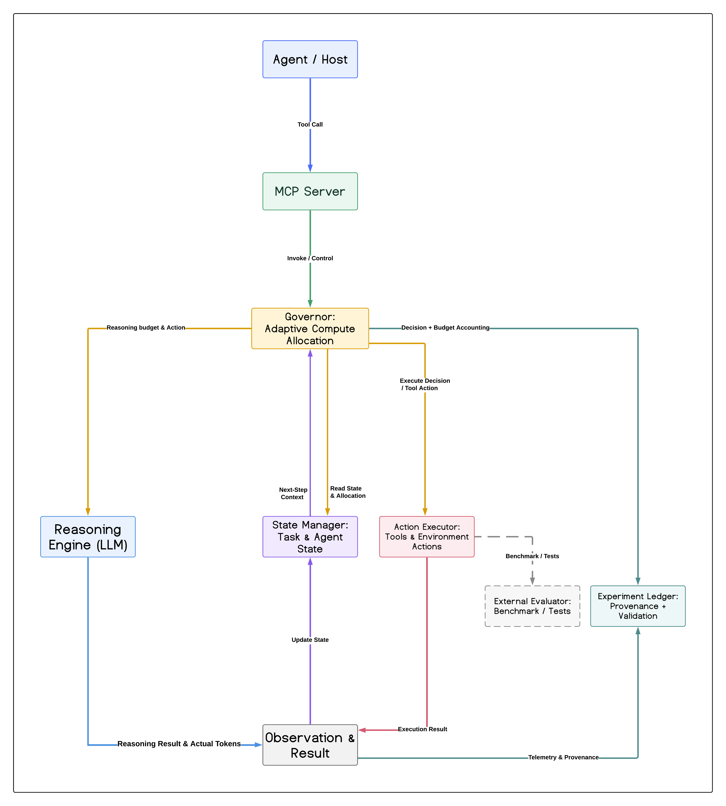
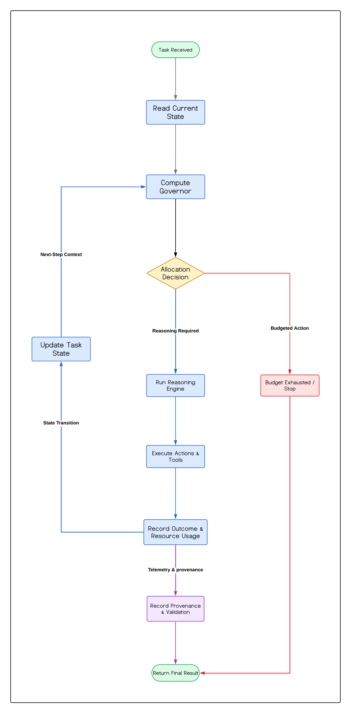

# Governor

**A reasoning-aware, budget-controlled compute-allocation layer for LLM agents.**

Governor decides *where scarce reasoning compute is worth spending* inside a
single episode — what to do next, at what effort, and when to stop — using
measured costs and calibrated probabilities rather than the model's own estimate
of how it is doing.

It does not reason and it does not execute. Those are separate layers behind
frozen interfaces, which is what lets four different reasoning engines sit behind
one contract without the controller knowing which one answered.

---

## Headline

| Axis | State |
|---|---|
| **Engineering** | **GREEN** — 257 tests, 26/26 experiments verify, end-to-end smoke passes |
| **Science** | real-LLM advantage **NOT VERIFIED** — 4 experiments, 3 axes, every confidence interval crossing zero |

**This repository reports a negative result, and reports it deliberately.** The
measured headroom is real on every axis tested — +0.164 on MATH, +0.232 on GPQA,
+0.055 on LiveCodeBench — but observable features never locate the items where
spending more actually pays. The sharpest diagnostic came from E0024: **45
allocation disagreements produced zero outcome differences.** The controller
reallocates among items where reallocation cannot change the outcome.

That is a claim about *observability*, not about the machinery. Every number
above is reproducible from this repository.

---

## Architecture



An agent or host calls in over MCP. Governor reads the current task and agent
state, decides how much reasoning budget the step is worth, and hands that
decision to the layers that carry it out. Results and their *measured* cost flow
back, state advances, and the loop repeats until the task ends or the budget
does.

## Workflow



The budget is tested **before** the call, so a refusal costs nothing and advances
no state. Cost is charged from an exact tokenizer — never nominal, never
estimated — which is what makes the next decision's remaining budget truthful.

Full detail in [ARCHITECTURE.md](ARCHITECTURE.md).

---

## Quickstart

Python 3.11+. No API key, no GPU, no Docker required for the test and smoke paths.

```bash
make test      # 257 tests
make verify    # every finalized experiment re-verifies from its own artifacts
make smoke     # end-to-end: both task families, MCP, traps, ledger  (~3s)

python scripts/resume_project.py   # orientation in under a minute; starts nothing
python scripts/project_health.py   # ENGINEERING_HEALTH + SCIENTIFIC_STATUS
```

Reproduction instructions for individual experiments are in
[REPRODUCE.md](REPRODUCE.md).

---

## Using your own API key

**You do not need one to evaluate this repository.** `make test`, `make verify`
and `make smoke` all run offline against a deterministic engine. A key is only
needed to collect *new* data from a live model.

Check what the harness can currently see:

```bash
make keys
```

```
API keys visible to the harness

  [  set  ]  openrouter   OPENROUTER_API_KEY from .env
  [not set]  groq         set GROQ_API_KEY  --  https://console.groq.com/keys
  [not set]  gemini       set GEMINI_API_KEY  --  https://aistudio.google.com/apikey
```

### Setting one

Any of these work; the environment always beats `.env`, so a shell variable
overrides a file without editing it.

**A file** — easiest, and `.env` is gitignored:

```bash
cp .env.example .env      # then fill in the providers you plan to use
```

**A shell variable** — for one session:

```bash
export OPENROUTER_API_KEY=sk-or-...
```

**Your MCP client** — the right answer when driving Governor from Claude Code or
any other MCP host. The server inherits the environment you declare, so there is
nothing to set up inside the harness itself and no key ever touches the repo:

```jsonc
// .mcp.json  (or your client's server config)
{
  "mcpServers": {
    "governor": {
      "command": "python",
      "args": ["-m", "governor.mcp.server"],
      "env": { "OPENROUTER_API_KEY": "sk-or-..." }
    }
  }
}
```

### Supported providers

| Provider | Variable | Get a key |
|---|---|---|
| OpenRouter | `OPENROUTER_API_KEY` | https://openrouter.ai/keys |
| Groq | `GROQ_API_KEY` | https://console.groq.com/keys |
| Google AI Studio | `GEMINI_API_KEY` | https://aistudio.google.com/apikey |

The older names — `OR_KEY`, `Groq`, `GEMINI_KEY` — still work, so existing setups
keep running; `make keys` will tell you which ones are using a deprecated name.

Keys are read only from the environment or an untracked `.env`, never from
source. A test scans the tree on every run, and `make keys` prints where each key
came from without ever printing the key.

---

## What makes this different

**Provenance is refusal, not documentation.** `ExperimentRun.finalize()` raises
unless the commit, model, runtime, budget, seeds, split, metric, raw rows and
config all exist and verify. You cannot record an unreproducible result by
accident.

**15 executable traps, each born from a real failure.** Every check in
`governor/harness/traps.py` exists because a specific mistake already happened
*and printed "PASS" first*. Missing evidence is a **red** check, so silence never
reads as success, and a red check forces `verdict = BLOCKED` at the ledger
regardless of what the caller reported. See [TRAPS.md](TRAPS.md).

**Withdrawn results stay on the record but cannot be cited.** The ledger is
append-only, so a withdrawn experiment still reads PASS on disk. Preserving that
row is right; citing it is not. `experiments/WITHDRAWN.json` plus a trap separate
the two.

**Ceiling before controller, enforced in code.** `require_gate_passed()` raises
rather than returning a flag: no predictor and no controller may be built for a
task family until a measured ceiling is on record for it. This exists because the
project once built an entire controller for an environment with no headroom to
recover.

**A closed-form headroom law.** `ceiling(n,k,p) = (E[min(k,X)] − k·p)/n` for
`X ~ Binomial(n,p)`, validated against simulation to 4e-3. It screens candidate
environments in microseconds instead of a day of quota.

---

## Positioning

Adaptive budgeted compute allocation for LLMs already exists. Governor sits in a
specific gap between three published lines of work:

- **[BAGEN](https://arxiv.org/html/2606.00198)** measures whether agents know
  their own remaining budget and finds they do not — systematic optimism across
  all 20 model-environment pairs, still predicting "feasible" >70% of the time
  after 60% of budget is gone. It builds no controller.
- **[AVA](https://openreview.net/forum?id=JMDCMf7mlF)** builds a
  budget-constrained controller with calibrated uncertainty, but on GSM8K, MATH,
  HotpotQA and HumanEval — no tool-use loop, no deterministic regression tests.
- **[The Replay Gap](https://arxiv.org/html/2608.08239)** shows that evaluating
  mid-trajectory policy changes by replaying logs is invalid: 92–97% of decisions
  get scored against states that never occurred.

Governor is the intersection — a controller evaluated by live execution rather
than replay, with the resource contract and the identification problem both
treated as first-class.

---

## Resource contract

Cost is unknown until *after* a generation is produced, so "a budget" has to be
defined before the spend is knowable. Three definitions were implemented and
measured on external benchmarks; two were eliminated.

| Contract | Measured outcome | Verdict |
|---|---|---|
| Hard worst-case reservation | engines used 28% of what was reserved | **rejected** — admission decided by what *fit*, not what was *worth it* |
| Forced consumption | budget binds exactly; ceiling +0.009 | **rejected** — tight control over a dial with no coupling to utility |
| Soft expected budget + hard runtime cap | binds and retains headroom | **adopted** |

---

## Repository layout

```
governor/
  accounting/    metering and hard budget enforcement
  execution/     per-action execution layer, trace-identical to the episode loop
  gate/          canonical episode loop (frozen) and the M2 engine contract
  harness/       experiment ledger and the 15 executable traps
  mcp/           12-tool MCP server over dependency-free JSON-RPC stdio
  models/        cost profiles, calibration, value models
  phase4/        headroom law, predictors, allocation rules, gatekeeper
experiments/     one directory per finalized experiment, each self-verifying
docs/            architecture and workflow diagrams
scripts/         resume, health, reproduction tooling
tests/           257 tests
```

---

## Limitations

Read these before citing any number.

- **The controller's advantage is not established.** Four experiments across
  three resource axes; every confidence interval crosses zero. The ceiling is
  real; the controller does not recover it.
- **MATH-500 cannot settle this.** A power analysis (E0022) put the requirement
  at ~26,031 items. The benchmark has 500.
- **The synthetic environment validates machinery, not skill.** Env 6 reference
  values are frozen at 1e-12 and prove the execution path is deterministic and
  reproducible. They say nothing about real reasoning ability.
- **One reasoning curve is VOID.** The Gemini run returned HTTP 429 on 492 of 500
  requests. It is registered as withdrawn rather than quietly dropped.

---

## Checkpoints

| Tag | Meaning | Use it when |
|---|---|---|
| `v2.2-final` | **research-complete** — the last state in which a scientific conclusion was reached | citing results, reproducing an experiment, auditing a claim |
| `v2.2-robustness` | **operational** — same science, hardened machinery | resuming work, running the system, building on it |

The science is identical between them; `v2.2-robustness` is strictly a superset
of the engineering. Neither tag will move.

**Do not resume from memory alone. Re-verify the repository, tests, ledger and
claims.** `scripts/resume_project.py` exists for exactly this.

---

## Further reading

| Document | Contents |
|---|---|
| [ARCHITECTURE.md](ARCHITECTURE.md) | components, frozen interfaces, experiment protocol |
| [FINAL-CLAIMS.md](FINAL-CLAIMS.md) | the VERIFIED / NOT VERIFIED / WITHDRAWN matrix |
| [FINAL-REPORT.md](FINAL-REPORT.md) | the full narrative, including what failed and why |
| [TRAPS.md](TRAPS.md) | all 15 traps, which have fired, and the design rules |
| [REPRODUCE.md](REPRODUCE.md) | how to re-run any recorded experiment |

---

## Licence

[MIT](LICENSE).
